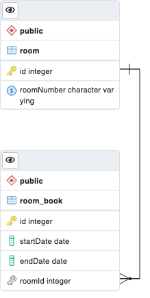

# Room Booking

## Installation

To install dependencies:
```
$ npm install
```
Before firts start you need to seed database by rooms by executing following comand:
```
$ npm run seed
```
To run the app:
```
$ npm run start
```

### `.env` file variables (see `.env.example` file):

```
#Connect to DB
DATABASE_HOST=
DATABASE_PORT=
DATABASE_NAME=
DATABASE_USER=
DATABASE_PASSWD=

# App
PORT=
```

---

## Swagger

Available on http://localhost:3000/api after run app

---

## Testing

```
npm run test
```

---

### ER DIAGRAM

<p align="center">
  
</p>
